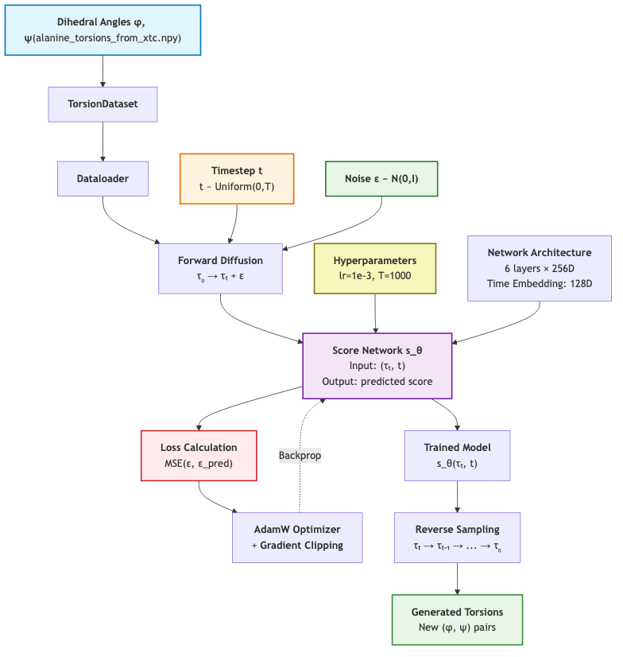
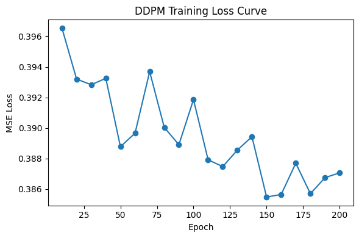

# Diffusion-SMA-MD: From Generative Diffusion to MD Trajectories

This repository demonstrates a minimal, research-oriented pipeline to test whether 
an AI-based molecular dynamics surrogate can generalize to small molecules beyond 
the original training setup.  

A central open question is whether such surrogate approaches can be **more efficient**
(or even more effective) than classical molecular dynamics for generating physically
plausible conformational ensembles. This repo provides a simplified environment to explore that idea on toy systems.

It is inspired by *Generation of conformational ensembles of small molecules via surrogate model-assisted molecular dynamics* (paper reference).

Pipeline overview:
1. **Diffusion (SMA)** training on simple molecular data (alanine dipeptide, `alanine.pdb`)
2. **Boltzmann correction** to enforce physical plausibility
3. **PDB generation** from sampled structures
4. **MD trajectory** initialized from generated PDB

The following diagram summarizes the training and sampling workflow.  
This is the most important part to realize the whole pipeline: connecting an AI-based model with biological data is never trivial. One must decide:
- **Which data** to use (here: torsional angles φ, ψ extracted from MD trajectories of alanine dipeptide)
- **What to provide as input** (noisy torsions τ_t and timestep t)
- **What to expect as output** (predicted score, eventually new torsional pairs leading to novel conformations)

<p align="center">
  Boltzmann->PDB->MD workflow“>
</p>

### Extensions
Although this demo focuses on torsional angles, the same design principal applies more broadly: 1) 3D Cartesian coordinates as input/output for full-atom modeling; 2) Contact maps or distance matrices for coarse-grained representations; 3) Residue-level features (sequence, secondary structure) to couple with structural learning ex.Alphafold).

These choices define how well AI models can interact with physical reality, and illustrate the key challenge: translatinge biological complexity into learnable machine representations.


**Note.** This project does not aim to replace classical MD. It serves as a prototype to study the trade-offs between AI-based generative surrogates and physics-based simulations on toy datasets.

<p align="center">
  
</p>

## References
- Sohl-Dickstein et al., Diffusion Probabilistic Models (2015).
- Song et al., Score-Based Generative Modeling (2021).
- *Generation of conformational ensembles of small molecules via surrogate model-assisted molecular dynamics*, [authors/year/journal—fill in].

---

## Data Availability

This project relies on publicly available molecular dynamics trajectories rather than shipping large binary files inside the repository.
| **Alanine Dipeptide (ALA2)** | Classical benchmark system for conformational sampling and validation of diffusion-based MD surrogates. | [MDShare – Alanine Dipeptide](https://markovmodel.github.io/mdshare/ALA2/#alanine-dipeptide) |
| **SMA–Protein System (optional)** | Custom trajectory used for proof-of-concept fine-tuning. | (to be hosted on Zenodo/Drive) |

To reproduce the experiments:

1. Download the ALA2 files (`ala2.xtc`, `ala2.pdb`) from the MDShare link above.
2. Place them in: data/raw
3. Run preprocessing:
```bash
python scripts/preprocess_data.py --input data/raw/ala2.xtc --output data/processed/
```

**Note.** If you prefer to work with your own trajectories, make sure to:
	•	Convert them to .xtc and .pdb formats,
	•	Define torsional angles (φ, ψ) extraction scripts under scripts/,
	•	Update configs/ala2.yaml accordingly.


## Project Structure

```
diffusion-sma-md/
├── colab/                    # Jupyter notebooks for experiments
│   ├── pipeline_sma_md.ipynb
│   └── Comparaison_Final.ipynb
├── configs/                  # Configuration files (to be added)
├── data/                     # Data directory
│   ├── raw/                  # Raw MD trajectories (download from MDShare)
│   └── processed/            # Processed features
├── docs/                     # Documentation and diagrams
│   ├── diagram.png
│   └── Shuyun_DENG_Rapport.pdf
├── figs/                     # Result figures and visualizations
│   ├── Free_energy.png
│   ├── Joint_tICA.png
│   ├── RMSD.png
│   └── ...
├── results/                  # Experimental results (generated)
├── scripts/                  # Preprocessing and utility scripts (to be added)
├── torsion_Diffusion.py     # Core diffusion model implementation
├── image.py                  # Plotting utilities
├── environment.yml           # Conda environment specification
└── README.md
```

## Quickstart

```bash
# Create and activate conda environment
conda env create -f environment.yml
conda activate diffusion-sma-md

# Launch Jupyter notebook
jupyter notebook colab/pipeline_sma_md.ipynb


